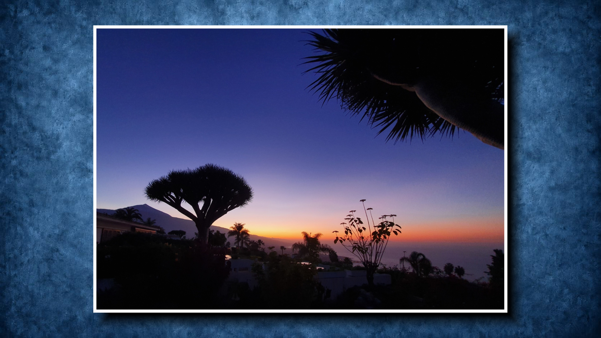

# JJS Kodi Picture Viewer

**Current version: 0.1.51**

JJS Kodi Picture Viewer is a fast, remote-friendly picture viewer for Kodi, designed especially for large local folders and network shares.

Browsing takes place inside Kodi's Pictures window through the add-on source. Selecting an image opens the dedicated JJS viewer instead of Kodi's native slideshow, avoiding full-folder slideshow preloading. The viewer keeps only the current image and, optionally, exactly one next image prepared in the background.

## Highlights

- Gallery and fullscreen display modes
- Fast one-image navigation with Left / Right
- Slideshow control with Up / Down
- Optional one-image look-ahead preloading
- Configurable background, white border and drop shadow
- Custom background selection through Kodi's normal File Manager sources
- Multiple transitions, including the projector-style push transition
- EXIF orientation handling
- Session cache for already decoded images
- Designed for SMB, NFS and other large network picture folders
- Exact cursor return to the last displayed image when leaving the viewer

## Installation

The installable Kodi ZIP is built automatically from this repository and published under **Releases**.

1. Open **Releases** on this repository.
2. Download **script.jjs.pictureviewer-<version>.zip**.
3. In Kodi, choose **Add-ons → Install from zip file**.
4. Select the downloaded ZIP.

Requirements:

- Kodi with Python 3 (xbmc.python >= 3.0.0)
- script.module.pil >= 5.1.0

Both dependencies are declared in addon.xml.

## Picture sources

The add-on browser shows the normal Kodi picture sources.

Use **Manage Kodi picture sources…** at the top level to switch to Kodi's native picture-source management. Adding, editing or removing a source there changes Kodi's normal picture sources.

The custom-background file picker starts from Kodi's normal **File Manager sources**, so local drives and configured network locations are directly accessible.

Supported image extensions: .jpg, .jpeg, .png, .webp, .bmp, .gif, .tif, .tiff.

## Controls

| Remote / key action | Function |
| --- | --- |
| **Left** | Previous image |
| **Right** | Next image |
| **Up** | Start slideshow; pause/resume while running |
| **Down** | Stop slideshow |
| **OK / Select** | Open the left settings menu |
| **Context Menu** | Open the settings menu; close it when already open |
| **Back** | Close the viewer and return to the Kodi picture list |

Left and Right always move by exactly one image. Navigation wraps around at the beginning and end of the folder.

Play/Pause and Stop media keys are deliberately **not intercepted** by the Picture Viewer, so they remain available for normal Kodi media and music playback.

## Default settings

A fresh installation starts with:

| Setting | Default |
| --- | --- |
| Display mode | **Gallery** |
| Gallery size | **85%** |
| Background | **Picture Viewer Default** |
| White border | **On** |
| Border width | **10 px** |
| Shadow | **On** |
| Shadow width | **26 px** |
| Shadow offset | **30 px** |
| Shadow strength | **60%** |
| Slideshow interval | **5 s** |
| Preload next image | **On** |
| Transition | **Projector** |
| Transition duration | **700 ms** |

Existing user settings are preserved during updates. Migrations only change settings when they can be identified as an exact former default.

## Backgrounds and gallery appearance

**Picture Viewer Default** uses the bundled blue textured background shown in the screenshot above.

Other background choices are Skin wallpaper, Black, and Custom image.

The gallery can optionally render a white border and a soft black drop shadow. Shadow width, offset and strength are independently adjustable.

## Slideshow and transitions

Available transitions are Off, Fade, Gentle zoom, Slide, and Projector.

Available transition durations are 120, 180, 250, 350, 500, 700, 1000 and 1500 ms.

The **Projector** transition is the default.

When the slideshow starts or resumes, a Play icon is shown briefly. Pause remains visible while paused, and Stop is shown briefly when the slideshow is stopped. An in-progress transition is allowed to finish cleanly before the slideshow state changes.

## Performance

The viewer renders to a 1920×1080 canvas while preserving each picture's aspect ratio.

Already decoded, EXIF-corrected images are kept in a small session RAM cache. This lets changes to gallery size, border or shadow be rerendered without rereading the original image from the NAS.

The most recently displayed Kodi picture-folder listing is cached for up to 30 minutes. When an image is opened from that listing, the viewer can reuse the exact sorted list instead of scanning the folder again.

Optional preloading handles only the next image. Navigation never waits synchronously for an in-flight prefetch. A blocked prefetch is abandoned after 12 seconds so navigation remains responsive.

## Project structure

The complete installable add-on lives under **script.jjs.pictureviewer/**.

Important files:

- addon.xml — add-on metadata and dependencies
- default.py — entry point
- resources/lib/viewer.py — browser, viewer, rendering and slideshow logic
- resources/skins/Default/1080i/PictureViewer.xml — WindowXML UI and transition animations
- resources/media/defaultBackground.jpg — bundled default background
- docs/pictureviewer.jpg — README screenshot

## Build and releases

The GitHub Actions workflow validates Python and XML syntax, checks required runtime files, creates the directly installable Kodi ZIP and publishes it as a GitHub Release.

The release asset is **script.jjs.pictureviewer-<version>.zip**. No additional ZIP wrapper is used.

## License

GNU General Public License Version 2.

This is an independent, unofficial Kodi add-on.
